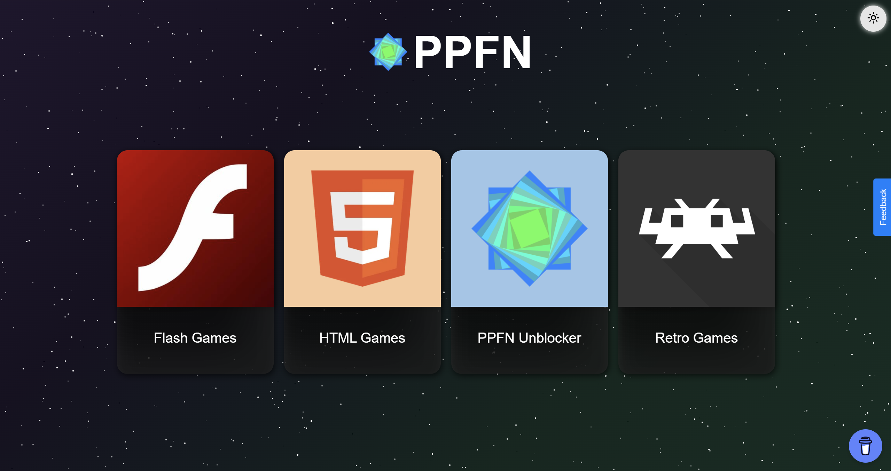
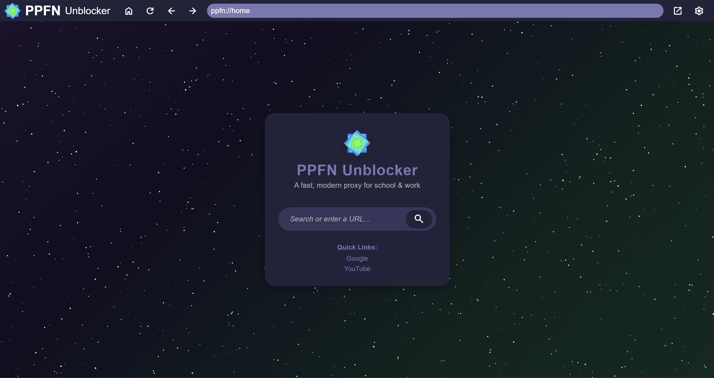

# PPFN

<!-- Badges -->


Welcome to **PPFN** — a simple, fast, and clean gaming site built from the ground up. PPFN is designed for easy hosting on a web server or a static hosting service like GitHub Pages. It provides a collection of HTML5 games in a user-friendly interface, making it easy to play and manage games from one place.

---

## Screenshots

- Main Page


- Unblocker


---

## Table of Contents

- [Official Instances](#official-instances)
- [Features](#features)
- [Getting Started](#getting-started)
  - [Hosting on GitHub Pages](#hosting-on-github-pages)
  - [Hosting on a Local or External Web Server](#hosting-on-a-local-or-external-web-server)
- [Project Structure](#project-structure)
- [Adding or Managing Games](#adding-or-managing-games)
- [Contributing](#contributing)
- [Acknowledgments](#acknowledgments)

---

## Official Instances

- [Official PPFN Site](https://poopoofartnut.xyz)
    - [Alternate redirect to official site](https://ppfn-official.github.io/ppfn)

---

## Features

- **Fast and Lightweight:** Minimal dependencies and optimized for quick loading.
- **Easy Game Management:** Add, remove, or update games by editing the games directory.
- **Modern UI:** Clean, responsive design.
- **Self-Contained:** No backend required for basic hosting; works with static file servers.
- **Open Source:** Contributions welcome!

---

## Getting Started

Before hosting your copy, please credit the author (for example, with a link to the official instance).

### Hosting on GitHub Pages

1. **Fork the Repository:**  
   Fork [this](https://github.com/ppfn-games/ppfn-static) repository to your GitHub account.

2. **Enable GitHub Pages:**  
   - Go to your repository settings.  
   - Scroll down to the **GitHub Pages** section.  
   - Select the branch to deploy from (usually `main` or `gh-pages`).  
   - Save your settings.

3. **Access Your Site:**  
   Your gaming site will be available at `https://<your-username>.github.io/ppfn/`.

### Hosting on a Local or External Web Server

1. **Clone the repository:**  
   ```bash
   git clone https://github.com/poopoofartnut/ppfn.git
   ```
2. **Install dependencies**  
   Run ```npm i```.

3. **Start Web Server:**  
   Run ```node server.js```.

4. **Access the Site:**  
   Navigate to the hosted URL or local server address in your browser.

> **Note:** Make sure you have [Node.js](https://nodejs.org/) installed.

---

## Adding or Managing Games

1. **Add a New Game:**
   - Create a new folder under `html-games/games/` (e.g., `html-games/games/mygame/`).
   - Place your game’s files (`index.html`, scripts, assets) in this folder.

2. **Update the Game List:**
   - Update it in the appropriate path's index.html.
   - Ensure all paths are correct and assets are included.

3. **Test the Game:**
   - Open the site in your browser and verify the new game appears and works as expected.

---

## Contributing

I welcome contributions! If you'd like to add features, fix bugs, or improve the project:

1. Fork the repository.
2. Create a new branch for your changes.
3. Make your edits and commit with descriptive messages.
4. Push your branch to your forked repository.
5. Open a pull request and describe your changes.

---

## Acknowledgments

- Inspired by [3kh0-lite](https://github.com/3kh0/3kh0-lite).

---

## License

This project is licensed under the GNU GPLv3 license. See [LICENSE](LICENSE) for details.

---

Enjoy PPFN! If you have questions or suggestions, feel free to open an issue or pull request.